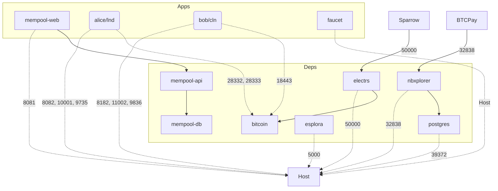

Nigiri Extensions
=================

This adds mempool, nbxplorer (btcpay backend), lnd, and core lightning to nigiri (bitcoind, electrs, esplora, faucet).



Setup
-----
1. Install nigiri https://github.com/vulpemventures/nigiri 
```
$ curl https://getnigiri.vulpem.com | bash
```
2. Start nigiri 
```
nigiri start
```
Note for users of macOS user, see https://github.com/vulpemventures/nigiri#:~:text=Note%20for%20users%20of%20macOS%20Monterey%20an%20onward 

3. Check that nigiri is running in docker
```
docker ps | grep nigiri
```
4. Now boot up the extensions. This will start mempool, btcpay backend, lnd, and core lightning in the nigiri docker network. If alice (lnd), or bob (cln), do not start up automatically or keep looping, just manually start them after the deps are loaded. 
```
docker compose up -d
```

Commands
---------
- To open Sparrow wallet using regtest
    ```
    # mac
    open /Applications/Sparrow.app --args -n regtest

    # linux
    SPARROW_NETWORK=regtest /opt/sparrow/bin/Sparrow
    ```
- To config Sparrow wallet to use Nigiri regtest
    ```
    Settings > General > Block explorer > custom > http://localhost:8081/tx
    
    Settings > Server > Private Elecrum > localhost:50000
    ```
    
- To mine a new block
    ```
    nigiri push 1
    ```
- To get bitcoin from the faucet (insert your bitcoin address)
    ```
    nigiri faucet bcrt****
    ```
- To open local mempool space
    ```
    open http://localhost:8081
    ```
- LND commands
    ```
    # 1. remote exec
    docker exec -it alice bash 

    # 2. get info
    lncli -n regtest getinfo

    # 3. note your identity_pubkey, it should be like 029e6b664b0edb029af794a09a47fe07f3eb1687a06ab2b33a38b1d775ecbd9c94

    # 4. note your connection should be like (using docker internal dns) 029e6b664b0edb029af794a09a47fe07f3eb1687a06ab2b33a38b1d775ecbd9c94@alice:9735

    # 5. get a bitcoin address
    lncli -n regtest newaddress p2wkh

    # 6. mine bitcoin to the bitcoin address (back on your host machine)
    nigiri faucet bcrt****

    # 7. connect to your peer bob (get his peer info, instructions below)
    lncli -n regtest connect 03571604c46fc96837967ffcb4f2e213394d0a57c511800bc49f3d77bdf1a8c777@bob:9735

    # 8. open a channel with bob
    lncli -n regtest openchannel 03571604c46fc96837967ffcb4f2e213394d0a57c511800bc49f3d77bdf1a8c777 5000000

    # 9. Now mine 6 blocks on the host and then get the channel status
    lncli -n regtest listchannels

    # 10. Create invoice
    lncli -n regtest addinvoice 1000

    # 11. Pay invoice
    lncli -n regtest payinvoice lnbcrt***

    # 12. Get alices invoice macaroon
    xxd -p -c 256 /root/.lnd/data/chain/bitcoin/regtest/invoice.macaroon | tr -d '\n'

    # 13. The url of LND Rest api should be
    http://localhost:8082

    # 14. Get certthumbprint
    openssl x509 -noout -fingerprint -sha256 -in /root/.lnd/tls.cert | sed -e 's/.*=//;s/://g'

    # 15. BTCPay Server expects a connection string like this
    type=lnd-rest;server=https://localhost:8082/;macaroon=0201036c6e640258030a10a6a541f77aa90f72dd1cb0612d5a26651201301a160a0761646472657373120472656164120577726974651a170a08696e766f69636573120472656164120577726974651a0f0a076f6e636861696e1204726561640000062053fc1d87d784a779c36bd36a866247a3ca6dc41c65f03cf29e5996f6e8dcc3a3;certthumbprint=F73BE6AF4F5B6E148D15FC3D363413C9B56D58730503465712E85A33B5BCFD68
    ```
- Core lightning commands
https://github.com/grubles/cln-cheatsheet
    ```
    # 1. remote exec
    docker exec -it bob bash 

    # 2. get info
    lightning-cli --network regtest getinfo

    # 3. note your pub aka id, it should be like 03571604c46fc96837967ffcb4f2e213394d0a57c511800bc49f3d77bdf1a8c777

    # 4. note your connection should be like (using docker internal dns) 03571604c46fc96837967ffcb4f2e213394d0a57c511800bc49f3d77bdf1a8c777@bob:9735

    # 5. get a bitcoin address
    lightning-cli --network regtest newaddr bech32

    # 6. mine bitcoin to the bitcoin address (back on your host machine)
    nigiri faucet bcrt****

    # 7. connect to your peer alice (get her peer info, instructions above)
    lightning-cli --network regtest connect 029e6b664b0edb029af794a09a47fe07f3eb1687a06ab2b33a38b1d775ecbd9c94@alice:9735

    # 8. open a channel with alice
    lightning-cli --network regtest fundchannel 029e6b664b0edb029af794a09a47fe07f3eb1687a06ab2b33a38b1d775ecbd9c94 2000000

    # 9. Mine some blocks and then see channel status
    lightning-cli --network regtest listchannels      

    # 10. Create an Invoice
    lightning-cli --network regtest invoice 1000 testlabel testdesc

    # 11. pay an invoice
    lightning-cli --network regtest pay lnbcrt*** 
    ```

BTCPay
------
To run BTCPay with the nigiri backend
- Clone the BTCPay Server code `git clone https://github.com/btcpayserver/btcpayserver.git`
- Install .net core deps
- Start BTCPay Server (without their docker deps since we are using nigiri docker config for postgres and nbxplorer)
```
dotnet restore
dotnet dev-certs https --trust
./build.sh
./run.sh
dotnet run --project BTCPayServer --launch-profile "Bitcoin"
```


Troubleshooting
--------------
If you change networks or wifi you might need to re-peer your lightning nodes. 

```
# sync the network on the host
nigiri push 1

# cln
lightning-cli --network regtest connect 029e6b664b0edb029af794a09a47fe07f3eb1687a06ab2b33a38b1d775ecbd9c94

# lnd
lncli -n regtest connect 03571604c46fc96837967ffcb4f2e213394d0a57c511800bc49f3d77bdf1a8c777@bob:9735
```